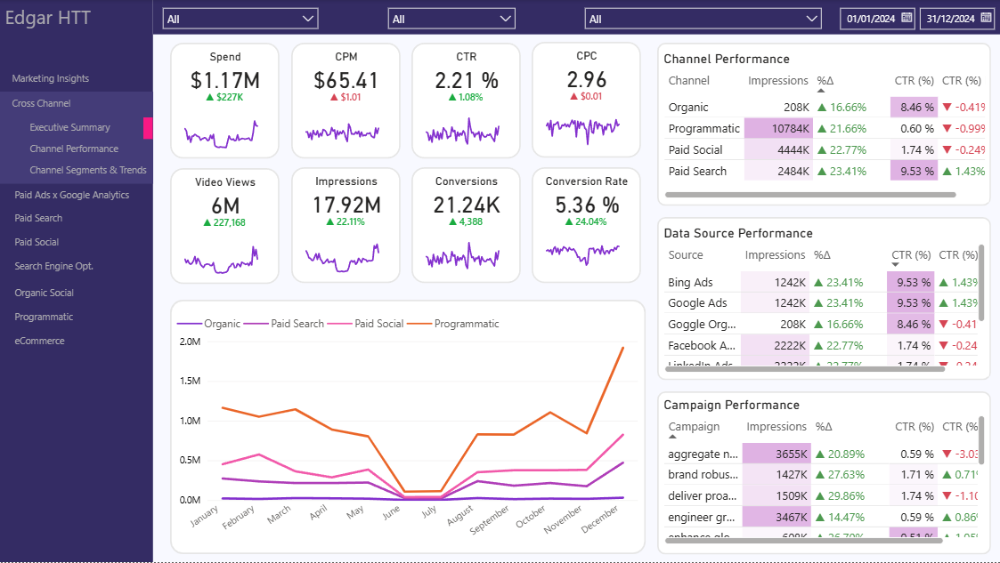

# Marketing Analytics Dashboard

## Overview
End-to-end marketing analytics project that simulates campaign data, builds a dimensional model, and visualizes performance in Power BI.

## Business Problem
Marketing teams need to monitor campaign performance across channels and evaluate ROI, conversions, and growth trends.

## Key Metrics
- Spend: Money spend on campaigns
- CPM: Cost Per Mille. Used to denote the price of 1,000 impressions
- CTR: Measures the percentage of people who click on a link, ad, or email after seeing it.
- CPC: Cost Per Click. Represents actual price paid for each user interaction, helping evalutate campaign efficency and ROI.
- Video Views: Amount of views a campaign has gathered. Where it makes sense
- Impressions: Amount of times an ad is displayed, regardless of whether it's interacted with.
- Conversions: Amount of times a user takes a desired action. Depends on the campaign objective.
- Conversion Rate: Conversions vs total clicks.

## Project Architecture
Config (YAML) -> Data Generation -> Data Modeling -> Dashboard

## Dashboard Preview

## Data Model
Star schema with fact and dimension tables:
- fact_marketing_performance
- dim_campaign
- dim_channel
- dim_date
- dim_data_source

## Tools
- Python
- Pandas
- Power BI
- YAML configuration
- Dimensional modeling

## How to Run
1. Install dependencies
2. Run the data generator
3. Open the Power BI dashboard